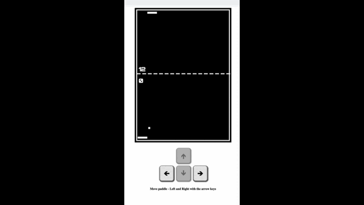

# TypePong

Classic Pong Game in Typescript - Portrait Mode


## Demo
<p align="center">
  
</p>


## Build Game

To deploy this project install parcel

```bash
  npm install -g parcel-bundler
```
Build Game

```bash
  parcel index.html
```

Enjoy! :)
